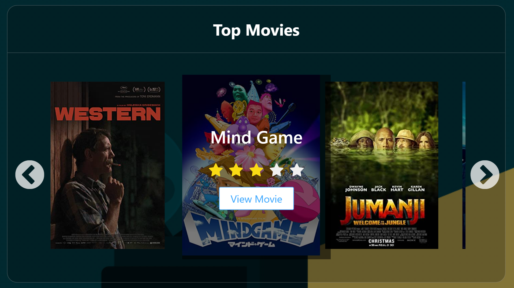
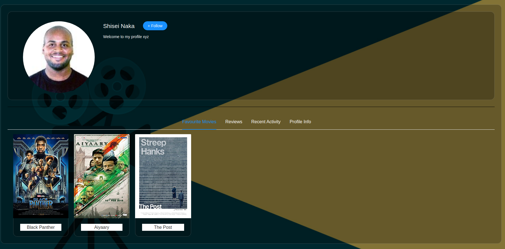
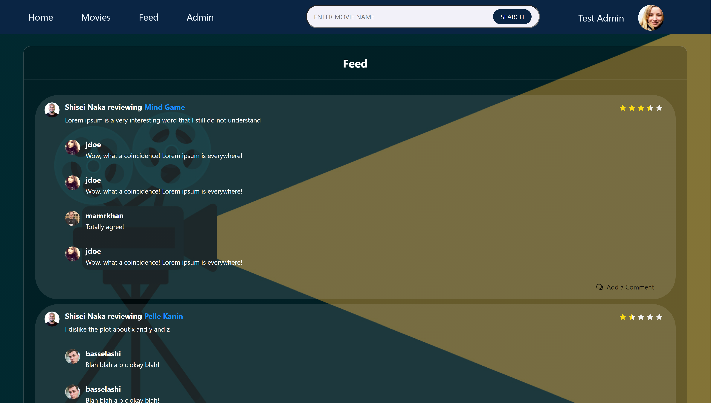

# TEAM02 - MovieBook

Welcome to MovieBook, a social media application for Movie Users.
Here is how to setup the web application and user it.

## Table of Contents
- [Table of Contents](#table-of-contents)
- [Heroku Link](#heroku-link)
- [Setting up MovieBook](#setting-up-moviebook)
  * [Run the Front-End](#run-the-front-end)
  * [Running the Back-End](#running-the-back-end)
- [User Credentials](#user-credentials)
- [How To Use The Application](#how-to-use-the-application)
  * [Logging in](#logging-in)
  * [Looking at Movies](#looking-at-movies)
    + [Individual Movies](#individual-movies)
      - [Leaving a Review](#leaving-a-review)
      - [Leaving a comment](#leaving-a-comment)
  * [Viewing Profiles](#viewing-profiles)
  * [Viewing User Feed](#viewing-user-feed)
  * [Searching for Movies](#searching-for-movies)
  * [Logging Out](#logging-out)
  * [Administration Panel **(Admins Only)**](#administration-panel----admins-only---)
- [Backend Routes & Middleware](#backend-routes---middleware)
  * [Middleware](#middleware)
    + [mongoChecker](#mongochecker)
    + [authenticateAdmin](#authenticateadmin)
    + [authenticate](#authenticate)
    + [unauthenticate](#unauthenticate)
  * [Backend Routes](#backend-routes)
    + [Logging in and out](#logging-in-and-out)
      - [Log in](#log-in)
      - [Log Out](#log-out)
    + [Registering a user](#registering-a-user)
    + [Getting user details](#getting-user-details)
    + [Follow a user](#follow-a-user)
    + [Get Movie by ID](#get-movie-by-id)
    + [Get Random Movie](#get-random-movie)
    + [Get New Movies](#get-new-movies)
    + [Adding a review](#adding-a-review)
    + [Add a comment to a review](#add-a-comment-to-a-review)
    + [Get Comments based on review id](#get-comments-based-on-review-id)
    + [Get all reviews by a User](#get-all-reviews-by-a-user)
    + [Get all comments by a User](#get-all-comments-by-a-user)
    + [Get User's Favourite Movies](#get-user-s-favourite-movies)
    + [Update User Biography](#update-user-biography)
    + [Update User Picture](#update-user-picture)
    + [Get User Feed](#get-user-feed)
    + [Admin APIs](#admin-apis)
      - [Getting all Users](#getting-all-users)
      - [Delete User](#delete-user)
      - [Update User (Admin Rights)](#update-user--admin-rights-)
      - [Add Movie](#add-movie)
    + [Search Functionality](#search-functionality)
      - [Searching for movies](#searching-for-movies)
- [Libraries & Frameworks Used](#libraries---frameworks-used)

## Heroku Link

http://moviebook309.herokuapp.com/

## Setting up MovieBook

From CLI run the command `git clone https://github.com/csc309-winter-2021/team02.git`

### Run the Front-End
From CLI navigate into the cloned directory

Switch into the client directory using `cd client`

Run the command `npm install`

Wait for all the dependencies to be installed

Run the command `npm start`

The web application will be available on `http://localhost:3000`

### Running the Back-End
Once the repository has been closed navigate to the route of the repository and run the command `npm install`

One the dependencies have been installed, run the command `npm start`

The server should be available at `http://localhost:5000`

## User Credentials

To login to the application, here are two sets of credentials

| Username | Password | Role |
| -------- | -------- | ---- |
| user | user | Regular User |
| admin | admin | Admin User |

## How To Use The Application

### Logging in

To login use the credentials provided above,  User are *user* or *admin*
Enter the credentials in the login form on the home page.  


Then click on the **Sign In** button


If the login in successful you will be authenticated to have access to different pages.
To sign out, you may click on the log out button in the navigation bar.

### Looking at Movies

The Default movies page is the gallery. Non-authenticated users can access this page.
It shows a list of movies as follows


#### Individual Movies
To look at an individual movie, you can click on the movie title in different places such
as in top movies, random movie, or feed.
For example, you can click on *View Movie* in top movies


This will take you the movie page.  


Here you will be able to view details and leave a comment or post *only if you are authenticated*. If not, then you can still
the view the movie

##### Leaving a Review
To leave a review, click on the button that says **+ Add a Review**
This will give you at text box where you can enter your review and leave a rating.
To save the review click on **Post Review** or to cancel click **Cancel Review**  


On the Movie page we can see comments and reviews that other users have left about the movie.

A review looks like this:  


##### Leaving a comment

Adding comments is a very similar procedure, click on the **Add a Comment** button located in the bottom right of the review.
This will open a textbox that will allow you to leave a comment.  
If you click on **Post Comment** the comment will be appended to the end of the review.  


### Viewing Profiles

We can visit profiles from the reviews page or in the random movie review by clicking on the user's name.  


Clicking on this will take us to the user profile.

Here you will see an image of the user, a follow button, number of followers, and several tabs.
The tabs show:
- Favourite Movies, based on 5-star rating reviews
- Reviews
- Comments

An example of a user profile is below:  


The follow button will toggle to the state of follow, that means that if you are following the user it will say *Unfollow* otherwise it will say *Follow*,
clicking on the button will update the state.


### Viewing User Feed

User feed displays reviews on movies from users that the authenticated user follows. As shown in the individual movie page,
users can also add comments to others' reviews.



### Searching for Movies
To search for a movie, simply enter in a word or phrase of the movie title into the search bar (in the navigation bar) and click search.

The search bar looks like:  


When you click on search you are directed to a new page that will show the movie results.


### Logging Out

To log out, simply click on the log out button in the Navigation bar and you will be redirected to the log in page.


### Administration Panel **(Admins Only)**

The admin panel is only available through the admin tab in the navigation bar (only appears for admins).
It can also be viewed from `/admin`

An example of the Admin Tab in the navigation bar is below:  


The Admin panel has two tabs:
- Users
- Add Movies

The users table can be used to promote users to admins or demote admin to regular users.
The admin just needs to click on the button. Other feature is that Admins can delete users, to do this they just need to click on the delete button.  


For movies, admins are able to add movies.
The admin can fill in the form and then they are able to submit it and the movie is stored in the database


The description will only be updated if the user clicks on *OK*.

## Backend Routes & Middleware

### Middleware

We created three different sete of middleware that are used with our routes. These are:
1. mongoChecker
1. authenticateAdmin
1. authenticate
1. unauthenticate
1. multipartMiddleware 

#### mongoChecker

mongoChecker is used to ensure that the connection to mongo is up and running.

#### authenticateAdmin

authenticateAdmin is used as middleware for routes for the Admin panel, these routes are allow to be used by users that are Admins.  
The middleware checks the current session for the user to see a session exists and if the user is an admin by checking if the *user.isAdmin* propery is set to true.

#### authenticate

authenticate is used to make sure that a use is logged in, this is for requesting data that requires a users to be logged in to access.

#### unauthenticate

Is middleware for unauthenticated users.

#### multipartMiddleware 

Middleware used for uploading images to acces them from the request

### Backend Routes
#### Logging in and out
##### Log in

We have a post route
```
POST http://localhost:5000/user/login
```  
This route expects to received the username and password are JSON attributes in the body.

*Example Request Body*
```
{
	"username": "user",
	"password": "user"
}
```

This route is used to pass the login details entered by the user to the server, in our to check validate with the database. The password is compared to a salted hash.

The response of this request, is in JSON which contains the returned user

*Example Response*
```
{
    "id": "606db37aac310914b89e7564",
    "username": "user",
    "picture": "/images/profile.png",
    "isAdmin": false
}
```  
A cookie is also return.

##### Log Out

Logging out uses a get route.  
```
GET http://localhost:5000/user/logout
```  
No items are required in the request body.  
This deletes the session from the database, to stop the user from logging in again using the same session.

*Response*  
```
true
```

#### Registering a user
This route is connected to the sign up form. It is a post route that hits the endpoint `/user/register`.

*Example Call*
```
POST http://localhost:5000/user/register
```  

The request body for this post route should contain username, password and full name of the new user in JSON format.  

*Example Request Body*
```
{
  "fullName": "user 123",
  "username": "user123",
  "password": "my really strong password"
}
```

The successful response is some details about the user.  
*Example Response*
```
{
    "id": "606e1507c7b52310b6ae0a68",
    "username": "user123",
    "fullName": "user 123",
    "picture": "/images/profile.png",
    "isAdmin": false
}
```
#### Getting user details
A GET request with the username appended to end of the URL will return a user's detail. For this request to be successful it requires the user to be logged in. This is used to display a user's information on their profile.  
The endpoint is `/api/user/:username`  

*Example call*  
```
GET http://localhost:5000/api/user/user
```  

*Example Response*  
```
{
    "id": "606db37aac310914b89e7564",
    "username": "user",
    "biography": "I love MovieBook!",
    "picture": "/images/profile.png",
    "isFollowing": false,
    "numberOfFollowers": 0
}
```

#### Follow a user
A PUT request to the endpoint `/api/user/follow/` with the user name appended to the end of the URL. This is used to follow a user's which allows for their reviews to be populated in your feed.

*Example Call*  
```
PUT http://localhost:5000/api/user/follow/user
```

*Example Response*
```
true
```

The response is `true` when the follow or unfollow action is successful.

#### Get Movie by ID
This is a GET request in which the movie object ID is appended to the end of the endpoint `/api/movie/`.  
This is used to populate the movie page which the information pulled from the data base.

*Example Call*
```
GET http://localhost:5000/api/movie/573a1390f29313caabcd4135
```

*Example Response*
```
{
    "movie": {
        "genres": [
            "Short"
        ],
        "cast": [
            "Charles Kayser",
            "John Ott"
        ],
        "countries": [
            "USA"
        ],
        "directors": [
            "William K.L. Dickson"
        ],
        "writers": [],
        "_id": "573a1390f29313caabcd4135",
        "plot": "Three men hammer on an anvil and pass a bottle of beer around.",
        "runtime": 1,
        "num_mflix_comments": 1,
        "title": "Blacksmith Scene",
        "fullplot": "A stationary camera looks at a large anvil with a blacksmith behind it and one on either side. The smith in the middle draws a heated metal rod from the fire, places it on the anvil, and all three begin a rhythmic hammering. After several blows, the metal goes back in the fire. One smith pulls out a bottle of beer, and they each take a swig. Then, out comes the glowing metal and the hammering resumes.",
        "released": "1893-05-09T00:00:00.000Z",
        "rated": "UNRATED",
        "awards": {
            "wins": 1,
            "nominations": 0,
            "text": "1 win."
        },
        "lastupdated": "2015-08-26 00:03:50.133000000",
        "year": 1893,
        "imdb": {
            "rating": 6.2,
            "votes": 1189,
            "id": 5
        },
        "type": "movie",
        "tomatoes": {
            "viewer": {
                "rating": 3,
                "numReviews": 184,
                "meter": 32
            },
            "lastUpdated": "2015-06-28T18:34:09.000Z"
        }
    },
    "reviews": [
        {
            "comments": [
                "5a9427648b0beebeb69579fe",
                "606a0cdca768344bbd648070",
                "606a414ddb81114f382ad436",
                "606a4590b0548650cb01866f",
                "606a45f6b0548650cb018670",
                "606a4618b0548650cb018671",
                "606a461db0548650cb018672",
                "606e105e0d100296b32c129d",
                "606e10670d100296b32c129e"
            ],
            "comments_data": [],
            "_id": "6064ad4518550f84dd915100",
            "rating": 5,
            "user_id": "606b34fe019bae1765a273f7",
            "movie_id": "573a1390f29313caabcd4135",
            "review": "love this movie",
            "__v": 8
        },
        {
            "comments": [
                "606b2a44a7ab3a1484de08a4",
                "606b3918bac0b519951ad6ca",
                "606ba4e73b05cd01d6ab86c0",
                "606e0f4f0d100296b32c129c"
            ],
            "comments_data": [],
            "_id": "60666e1dec653bc5efb18fab",
            "rating": 3.5,
            "user_id": "606b34fe019bae1765a273f7",
            "movie_id": "573a1390f29313caabcd4135",
            "review": "Weird!",
            "__v": 4
        }
    ],
    "comments": {
        "{ comments:\n   [ 5a9427648b0beebeb69579fe,\n     606a0cdca768344bbd648070,\n     606a414ddb81114f382ad436,\n     606a4590b0548650cb01866f,\n     606a45f6b0548650cb018670,\n     606a4618b0548650cb018671,\n     606a461db0548650cb018672,\n     606e105e0d100296b32c129d,\n     606e10670d100296b32c129e ],\n  comments_data: [],\n  _id: 6064ad4518550f84dd915100,\n  rating: 5,\n  user_id: 606b34fe019bae1765a273f7,\n  movie_id: 573a1390f29313caabcd4135,\n  review: 'love this movie',\n  __v: 8 }": {},
        "{ comments:\n   [ 606b2a44a7ab3a1484de08a4,\n     606b3918bac0b519951ad6ca,\n     606ba4e73b05cd01d6ab86c0,\n     606e0f4f0d100296b32c129c ],\n  comments_data: [],\n  _id: 60666e1dec653bc5efb18fab,\n  rating: 3.5,\n  user_id: 606b34fe019bae1765a273f7,\n  movie_id: 573a1390f29313caabcd4135,\n  review: 'Weird!',\n  __v: 4 }": {}
    }
}
```

#### Get Random Movie
This GET Request is used to pull information about a random movie from the database. This is used to display the random movie section on the home page.  

*Example Call*
```
GET http://localhost:5000/api/movie/random/movie
```

*Example Response*
```
{
    "movie": [
        {
            "_id": "573a1399f29313caabcec6c0",
            "plot": "A young writer is interrogated by a sadistic secret policeman. She is accused of embedding political messages in her children's stories. The entire movie takes place in one room, with only ...",
            "genres": [
                "Drama",
                "Thriller"
            ],
            "runtime": 89,
            "rated": "R",
            "cast": [
                "Alan Rickman",
                "Madeleine Stowe"
            ],
            "poster": "https://m.media-amazon.com/images/M/MV5BMTM1MjMxOTQ4N15BMl5BanBnXkFtZTcwNzI1MzMzMQ@@._V1_SY1000_SX677_AL_.jpg",
            "title": "Closet Land",
            "fullplot": "A young writer is interrogated by a sadistic secret policeman. She is accused of embedding political messages in her children's stories. The entire movie takes place in one room, with only the two actors. The movie is set in an unidentified, modern police state.",
            "languages": [
                "English"
            ],
            "released": "1991-03-06T00:00:00.000Z",
            "directors": [
                "Radha Bharadwaj"
            ],
            "writers": [
                "Radha Bharadwaj"
            ],
            "awards": {
                "wins": 1,
                "nominations": 1,
                "text": "1 win & 1 nomination."
            },
            "lastupdated": "2015-09-02 00:39:48.833000000",
            "year": 1991,
            "imdb": {
                "rating": 7.2,
                "votes": 1988,
                "id": 101597
            },
            "countries": [
                "USA"
            ],
            "type": "movie",
            "tomatoes": {
                "viewer": {
                    "rating": 4,
                    "numReviews": 2266,
                    "meter": 87
                },
                "dvd": "1991-09-12T00:00:00.000Z",
                "critic": {
                    "rating": 4.6,
                    "numReviews": 9,
                    "meter": 44
                },
                "lastUpdated": "2015-08-04T19:36:32.000Z",
                "rotten": 5,
                "production": "Media Home Entertainment",
                "fresh": 4
            }
        }
    ],
    "review": null
}
```

#### Get New Movies
This GET request is used to pull information about the 5 latest movies. This information is used to populate the movie gallery.

*Example Call*
```
GET http://localhost:5000/api/movie/new/movies
```

No request body required.

*Example Response*
```
[
    {
        "_id": "573a13f8f29313caabde8d7a",
        "plot": "Costi leads a peaceful life. At night he likes to read his 6-year-old son stories, to help him sleep. Their favourite is Robin Hood. Costi sees himself as the hero - righter of wrongs and ...",
        "genres": [
            "Comedy"
        ],
        "runtime": 89,
        "cast": [
            "Toma Cuzin",
            "Adrian Purcarescu",
            "Corneliu Cozmei",
            "Radu Banzaru"
        ],
        "num_mflix_comments": 1,
```

**The response is an array of 5 movies - the complete response is not shown in the example above.**  

#### Adding a review
This POST request is used to allow users to add reviews to movies. The endpoint used is `/api/movie/:id/review` where `:id` is replaced by the movie id. This route requires a request body.

*Example call*
```
POST http://localhost:5000/api/movie/573a1390f29313caabcd4135/review
```

*Example Request Body*
```
{
    "rating": 5,
    "user_id": "60631931ae924a0807a7a951",
    "review": "Great Movie"
}
```

The response shows confirmation that the review has been added.  
*Example Response*
```
{
    "comments": [],
    "comments_data": [],
    "_id": "606e1db6c7b52310b6ae0a69",
    "rating": 5,
    "user_id": "60631931ae924a0807a7a951",
    "movie_id": "573a1390f29313caabcd4135",
    "review": "Great Movie",
    "__v": 0
}
```

#### Add a comment to a review
This used the authenticate middleware so a session cookie is required before this will return a successfully response. This POST request is used to add comments to a review. This is used to communicate on reviews with other users in the form of comments.  

The endpoint used is `/api/feed/review/:id/comment` where `:id` is replaced with the object ID of the review.  

*Example Call*
```
POST http://localhost:5000/api/feed/review/606e1db6c7b52310b6ae0a69/comment
```

*Request Body*   
```
{
    "text": "I agree!"
}
```

*Example Response*  
```
{
    "review": {
        "comments": [
            "606e1fbec7b52310b6ae0a6a"
        ],
        "comments_data": [],
        "_id": "606e1db6c7b52310b6ae0a69",
        "rating": 5,
        "user_id": "60631931ae924a0807a7a951",
        "movie_id": "573a1390f29313caabcd4135",
        "review": "Great Movie",
        "__v": 1
    },
    "comment": {
        "_id": "606e1fbec7b52310b6ae0a6a",
        "user_id": "606db37aac310914b89e7564",
        "review_id": "606e1db6c7b52310b6ae0a69",
        "text": "I agree!",
        "date": "2021-04-07T21:10:22.387Z",
        "__v": 0,
        "user": {
            "id": "606db37aac310914b89e7564",
            "username": "user",
            "picture": "/images/profile.png",
            "isAdmin": false
        }
    }
}
```

The response original review and the comments associated with it.
#### Get Comments based on review id
This GET request is used to pull of the comments based for a single review. This is used to populate the reviews under movies and the feed. The endpoint used here is `/api/review/:id/comments` where `:id` is replaced by the object id of the review

*Example Call*
```
GET http://localhost:5000/api/review/606e1db6c7b52310b6ae0a69/comments
```
No Request body is required

*Example Response*
```
{
    "review": "606e1db6c7b52310b6ae0a69",
    "comment_ids": [
        {
            "_id": "606e1fbec7b52310b6ae0a6a",
            "user_id": "606db37aac310914b89e7564",
            "review_id": "606e1db6c7b52310b6ae0a69",
            "text": "I agree!",
            "date": "2021-04-07T21:10:22.387Z",
            "__v": 0
        }
    ]
}
```

#### Get all reviews by a User
This route requires the requestor to be logged in. This is used to get all the reviews created by a user, this populates their profile.

The endpoint used is `/api/profile/:id/reviews` where `:id` is replaced by user's object ID.

*Example Call*
```
GET http://localhost:5000/api/profile/606db37aac310914b89e7564/reviews
```

No Request Body is required.

*Example Response*
```
[]
```

**For this used since the user in question has not left a review on any movie so the array is empty**
#### Get all comments by a User
This route requires the requestor to be logged in. This is used to get all the comments created by a user, this populates their profile.

The endpoint used is `/api/profile/:id/comments` where `:id` is replaced by user's object ID.

*Example Call*
```
GET http://localhost:5000/api/profile/606db37aac310914b89e7564/comments
```

No Request Body is required.

*Example Response*
```
[
    {
        "comments": [
            "606e1fbec7b52310b6ae0a6a"
        ],
        "comments_data": [
            {
                "_id": "606e1fbec7b52310b6ae0a6a",
                "user_id": "606db37aac310914b89e7564",
                "review_id": "606e1db6c7b52310b6ae0a69",
                "text": "I agree!",
                "date": "2021-04-07T21:10:22.387Z",
                "__v": 0,
                "user": {
                    "username": "user",
                    "picture": "/images/profile.png"
                }
            }
        ],
        "_id": "606e1db6c7b52310b6ae0a69",
        "rating": 5,
        "user_id": "60631931ae924a0807a7a951",
        "movie_id": "573a1390f29313caabcd4135",
        "review": "Great Movie",
        "__v": 1,
        "user": {
            "username": "bassel10",
            "fullName": "Default Fullname",
            "picture": "/images/profile.png"
        },
        "movie": {
            "id": "573a1390f29313caabcd4135",
            "title": "Blacksmith Scene"
        }
    }
]
```

#### Get User's Favourite Movies
This route requires the requestor to be logged in. This is used to get all the movies that a user has reviewed, this populates their profile.

The endpoint used is `/api/profile/:id/movies` where `:id` is replaced by user's object ID.

*Example Call*
```
GET http://localhost:5000/api/profile/606db37aac310914b89e7564/movies
```

No Request Body is required.

*Example Response*
```
[]
```

**For this example used since they have not reviews a movie, they do not have any favourite movies, so the array is empty**

#### Update User Biography
This is a POST request that is used to update the biography of user. The biography is displayed to other users.

The endpoint used is `/api/profile/biography`.  

*Example Call*
```
POST http://localhost:5000/api/profile/biography
```

*Request Body*
```
{
  "bio": "hello, welcome to my Profile"
}
```

*Example Response*
```
{
    "bio": "hello, welcome to my Profile"
}
```

#### Update User Picture
This is a POST request that is used to update the profile picture user.

The endpoint used is `/api/profile/picture`.  

*Calls cannot be made to this endpoint from Postman since it expects an image to be uploaded from an HTML form*

#### Get User Feed
This is GET request used to get all the reviews by people who the logged in user is following. This is used to populate the user feed.

*Example Call*
```
GET http://localhost:5000/api/feed
```
There is no Request body required.
*Example Response*
```
[]
```
**An empty array is return if the user is not following anyone or if the users that they are following have not left any reviews**
#### Admin APIs
**These routes will only work if the user is an Admin (Please use the admin user to test)**  
##### Getting all Users
This route gets a list of all the users that are currently stored in the database. This is used to display the table of users in the Admin Panel. The table is where Admins can update rights or delete users.

*Example Call*
```
GET http://localhost:5000/api/admin/allusers
```
There is no request body to this request.

*Example Response*
```
{
    "user": [
        {
            "likedMovies": [],
            "followingUser": [
                "606785445048bb1d7c886c05",
                "60673dc4a3aad9116bd1d2f8"
            ],
            "usersIfollow": [],
            "_id": "60631931ae924a0807a7a951",
            "username": "bassel10",
            "__v": 0,
            "fullName": "Default Fullname",
            "picture": "/images/profile.png",
            "isAdmin": true
        },
```
**This returns an array of users, the sample shown above is not complete.**
##### Delete User
This DELETE route is used to delete a user from the application. The endpoint is `/api/admin/user/:id` where `:id` is replaced with the object ID of the user to be deleted.

*Example Call*
```
DELETE http://localhost:5000/api/admin/user/606e1507c7b52310b6ae0a68
```

There is no request body in this request.

*Example Response*
```
{
    "likedMovies": [],
    "followingUser": [],
    "usersIfollow": [],
    "_id": "606e1507c7b52310b6ae0a68",
    "username": "user123",
    "password": "$2a$10$VA65Vs3Q7Lv0lK8cw1ss6u3sYjNRt48KKnR3GTHHimcOe.zUJQ0r6",
    "fullName": "user 123",
    "picture": "/images/profile.png",
    "biography": "I love MovieBook!",
    "isAdmin": false,
    "__v": 0
}
```

##### Update User (Admin Rights)
A PUT request used to update the *isAdmin* property of a user, to elevate or demote them.   
The endpoint is `/api/admin/user/:id` where the object id of the use is appended to the URL. A JSON request body with the parameter *isAdmin* is expected.

*Example Call*  
```
PUT http://localhost:5000/api/admin/user/60631931ae924a0807a7a951
```  

*Request body*
```
{
    "isAdmin": false
}
```

*Example Response*
```
{
    "likedMovies": [],
    "followingUser": [
        "606785445048bb1d7c886c05",
        "60673dc4a3aad9116bd1d2f8"
    ],
    "usersIfollow": [],
    "_id": "60631931ae924a0807a7a951",
    "username": "bassel10",
    "password": "$2a$10$pYckU5vO1on9riUT1ts0u./Gx1gjplqJkugARMNN1R2tf32pyUfOK",
    "__v": 0,
    "fullName": "Default Fullname",
    "picture": "/images/profile.png",
    "isAdmin": true
}
```
##### Add Movie
This POST request is used to add a movie to the database. The endpoint is `/api/admin/addmovie`.  
*Example Call*
```
POST http://localhost:5000/api/admin/addmovie
```

The request body needs 5 attributes:
- "title": "value1"
- "plot": "value2"
- "runtime": int1
- "year": int2
- "poster": "value3"

*Example Request Body*
```
{
    "title": "jaws3",
    "plot": "a killer shark looks to attack beachgoes",
    "runtime": 91,
    "year": 1996,
    "poster": "/images/15.jpg"
}
```

*Example Response*
```
{
    "genres": [],
    "cast": [],
    "countries": [],
    "directors": [],
    "writers": [],
    "_id": "606e28d5367d391659dca850",
    "title": "jaws3",
    "fullplot": "a killer shark looks to attack beachgoes",
    "plot": "a killer shark looks to attack beachgoes",
    "runtime": 91,
    "year": 1996,
    "poster": "/images/15.jpg",
    "__v": 0
}
```

#### Search Functionality

##### Searching for movies
A get request is used to search for movies in the database. The endpoint here is `/api/search/movies/:name`  

The endpoint takes in the name of the movie in the URL so there are no values in the body.

*Example call*
```
GET http://localhost:5000/api/search/movies/black pirate
```

The response to this should be an array of movies with a name that matches the URL parameter provided.  
*Example response*
```
[
    {
        "genres": [
            "Adventure",
            "Action"
        ],
        "cast": [
            "Billie Dove",
            "Tempe Pigott",
            "Donald Crisp",
            "Sam De Grasse"
        ],
        "countries": [
            "USA"
        ],
        "directors": [
            "Albert Parker"
        ],
        "writers": [
            "Douglas Fairbanks (story)",
            "Jack Cunningham (adapted by)"
        ],
        "_id": "573a1391f29313caabcd8268",
        "plot": "Seeking revenge, an athletic young man joins the pirate band responsible for his father's death.",
        "runtime": 88,
        "num_mflix_comments": 2,
        "poster": "https://m.media-amazon.com/images/M/MV5BMzU0NDkyMjEzMV5BMl5BanBnXkFtZTgwMTcyMzEyMjE@._V1_SY1000_SX677_AL_.jpg",
        "title": "The Black Pirate",
        "fullplot": "A nobleman vows to avenge the death of his father at the hands of pirates. To this end he infiltrates the pirate band. Acting in character he is instrumental in the capture of a ship, but things are complicated when he finds that there is a young woman on board whom he wishes to protect from the threat of rape.",
        "released": "1926-03-08T00:00:00.000Z",
        "awards": {
            "wins": 1,
            "nominations": 0,
            "text": "1 win."
        },
        "lastupdated": "2015-08-22 01:10:11.970000000",
        "year": 1926,
        "imdb": {
            "rating": 7.2,
            "votes": 1146,
            "id": 16654
        },
        "type": "movie",
        "tomatoes": {
            "viewer": {
                "rating": 3.3,
                "numReviews": 1390,
                "meter": 70
            },
            "dvd": "1999-10-12T00:00:00.000Z",
            "critic": {
                "rating": 8.1,
                "numReviews": 9,
                "meter": 100
            },
            "lastUpdated": "2015-07-22T19:23:50.000Z",
            "rotten": 0,
            "fresh": 9
        }
    }
]
```
## Libraries & Frameworks Used
- React
- Ant Design
- React Slick
- Cloudinary
- MongoDB
- Express
